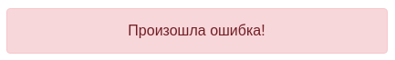
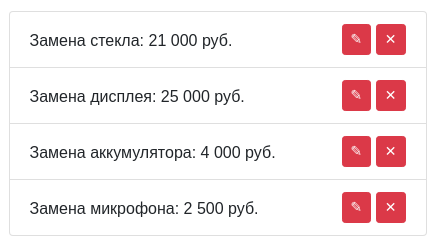
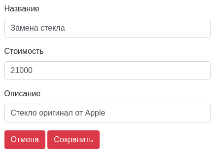

# Services List

[](https://ci.appveyor.com/project/AsotikovaSvetlana/services-list)

### [Demo](https://asotikovasvetlana.github.io/services-list/)


**Environment:** Redux, Redux Thunk, React Router, Fetch API, JavaScript, HTML5, CSS3.

## Старт

Cклонируйте репозиторий и установите зависимости
```
npm install
```

Запустите проект
```
npm start
```

## Описание

При переходе на главную страницу пользователь автоматически перенаправляется на адрес '/services', на котором загружается список услуг (GET /api/services).

При загрузке данных (GET) отображается спиннер (лоадер):


При получении ошибки:
 


При нормальных загруженных данных:



Для главной страницы сервер присылает данные в формате:
```json
[
    {"id":1,"name":"Замена стекла","price":21000},
    {"id":2,"name":"Замена дисплея","price":25000},
    {"id":3,"name":"Замена аккумулятора","price":4000},
    {"id":4,"name":"Замена микрофона","price":2500}
]
```

При нажатии на кнопку удалить происходит удаление записи с последующей загрузкой всего списка (DELETE /api/serviced/:id, где id - id сервиса).

При нажатии на кнопку редактировать происходит переход по адресу: '/services/:id`, где id - это id сервиса.

В форму подтягиваются данные через GET-запрос:



При нажатии на кнопку Сохранить, происходит сохранение записи:
1. Отображается спиннер
1. Если сохранение прошло успешно, выполняется переход на страницу со списком
1. Если сохранение прошло с ошибкой, переход не осуществляется, высвечивается сообщение об ошибке.

При нажатии на кнопку Отмена, происходит возврат к предыдущей странице.
